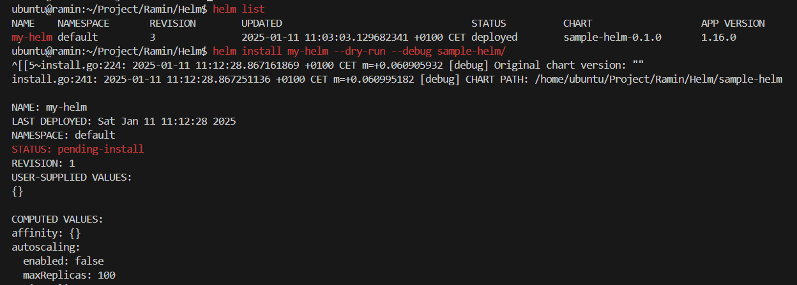

## install the helm as k8s package manager
- curl -fsSL -o get_helm.sh https://raw.githubusercontent.com/helm/helm/main/scripts/get-helm-3
- chmod +x get_helm.sh
- ./get_helm.sh
- helm repo add stable https://charts.helm.sh/stable
- helm repo update

## This is the architecture of helm

## helm structure creation 

## We can make changes in helm structure files like values.yaml and install the new helm in our cluster

## Helm Upgrade and rollback

## install "dry-run" to test charts before installing them in K8s cluster

## validate the yaml files by "helm template" and "helm lint"

## "helm uninstall"

## 58th

