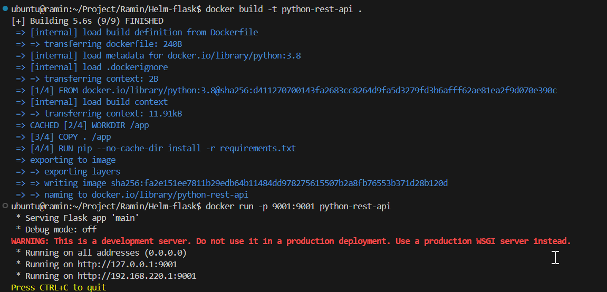
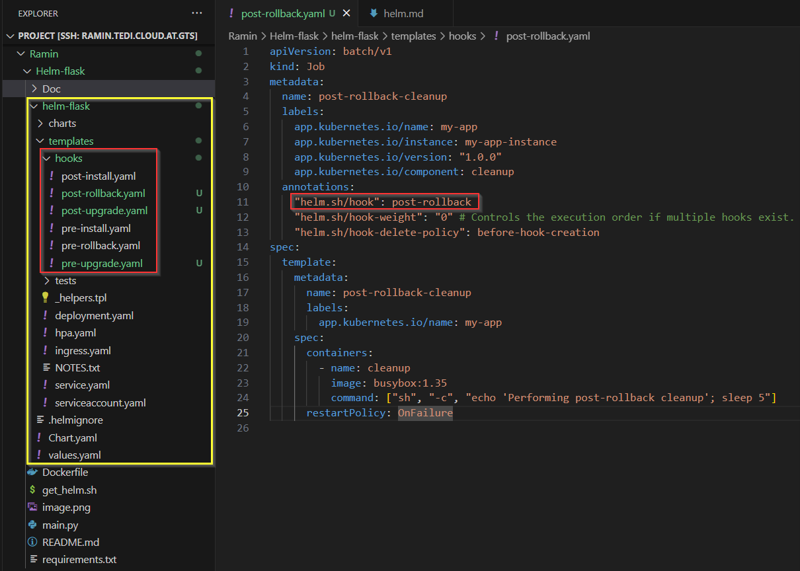

## install the helm as k8s package manager
- curl -fsSL -o get_helm.sh https://raw.githubusercontent.com/helm/helm/main/scripts/get-helm-3
- chmod +x get_helm.sh
- ./get_helm.sh
- helm repo add stable https://charts.helm.sh/stable
- helm repo update

## This is the architecture of helm

## helm structure creation 

## We can make changes in helm structure files like values.yaml and install the new helm in our cluster

## Helm Upgrade and rollback

## install "dry-run" to test charts before installing them in K8s cluster

## validate the yaml files by "helm template" and "helm lint"

## "helm uninstall"

## A Python App with Flask from "https://github.com/raminsalah/helm-flask" repo

## After Pushing the image of our containerized App into duckerhub we can create a helm chart and modify the necessary yamls like

## we can see that inside template we can invoke the values.

## If minikube could not pull the image we can pull it locally and then load it into minikube

## there are also many pre-built helm charts in different helm repos which we can use
- one of the most complete repos is bitnami with "https://charts.bitnami.com/bitnami" 
- we can find available repos from helm hub "https://artifacthub.io/"

## Add a repo into my local helm and install a chart from that repo

## display a helm chart documentation

## helm hooks

## To share our chart with others we use 'helm package'
$ helm package helm-flask  ---> this creates a .tgz file

## It is possible to pull the whole helm chart from its repo into our local machine
 

## Using "helm inteliscence extension" to populate the variables in helpers.tpl
- we just need to type "." and then tab or type "include" and then tab and it shows all the available values in chart to chose among

## copy a snippet of code from Values with the same indentation we use " - toYaml func"
