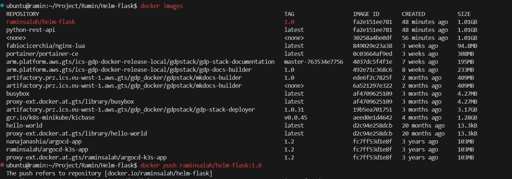

## With Docker

1) Containerization of the App
  - docker build -t python-rest-api .

2) Running the Container
 - docker run -p 9001:9001 python-rest-api

3) Tag the image based on the dockerhub repo 
 - docker tag python-rest-api raminsalah/helm-flask:1.0

4) docker push

-------------------------------------------------
## Without Docker

1) pip3 install --upgrade pip

2) pip3 install flask

3) python3 -m flask --version

4) python3 main.py
